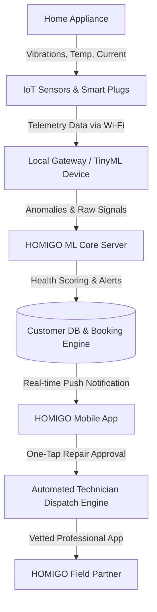

# HOMIGO: Service On The Go
### *Business Model & Product Strategy Document*

---

## 1. Executive Summary
**HOMIGO** is a premium, unified Annual Maintenance Contract (AMC) and predictive maintenance platform designed to bring all home appliances under a single, brand-agnostic protection plan. Inspired by the convenience of **Urban Company** (vetted, door-to-door technician dispatch) and the warranty security of **Onsitego** (hassle-free claims and extended coverage), HOMIGO introduces a major paradigm shift: **IoT-enabled predictive maintenance**.

Rather than waiting for an appliance to break (reactive repair) or navigating different service portals for each brand, homeowners can manage and monitor their entire appliance ecosystem through a single high-fidelity application. By integrating simple, non-intrusive smart telemetry sensors, HOMIGO predicts failures before they occur, alerts users, and lets them schedule maintenance with a single tap.

---

## 2. The Problem Landscape
Urban households own an average of 5 to 10 major electrical appliances (Air Conditioners, Refrigerators, Washing Machines, Microwaves, Water Purifiers, etc.), often spanning different brands (Samsung, LG, Whirlpool, Daikin, Kent). This leads to several pain points:
1. **Warranty and AMC Fragmentation**: Managing separate AMC contracts, warranty documents, and contact numbers for each brand is a logistical headache.
2. **The "Break-Fix" Crisis**: Repairs are almost always reactive. A refrigerator compressor failure or AC breakdown occurs without warning, causing immediate food spoilage or discomfort and requiring urgent, expensive repairs.
3. **Technician Trust Gap**: Booking local local technicians often leads to inconsistent service quality, fluctuating pricing, and unvetted access to homes.
4. **Varying Lifespans**: Appliances bought in different years require different levels of care, yet existing plans do not dynamically price protection based on appliance age and wear.

---

## 3. The HOMIGO Solution & USP
HOMIGO consolidates all home maintenance needs under a single roof through three core pillars:

### A. Brand-Agnostic Unified AMC
Users register all household appliances, regardless of brand, age, or model, into a single dashboard. HOMIGO offers flexible subscriptions (6-month, 9-month, 1.5-year, 2-year, and 3-year extendable plans) that cover:
*   Unlimited free breakdowns and repairs.
*   Spare parts and labor costs.
*   Preventative maintenance visits (e.g., deep wet-cleaning for ACs every 6 months).
*   Gas charging, condenser repairs, and filter replacements.

### B. Predictive Maintenance via IoT Telemetry (The USP)
For premium plans, HOMIGO installs a small, non-intrusive smart monitoring suite (smart plugs to track current/voltage, and small vibration/temperature sensors):
*   **Vibration Analysis**: Accelerometers track compressor/motor vibrations (g-force). A deviation in vibration patterns detects bearing wear or unbalanced loads.
*   **Thermal Monitoring**: Temperature sensors detect cooling declines or overheating coils.
*   **Power Consumption Telemetry**: Current sensors detect voltage spikes, continuous high-load draws, or short cycles indicative of compressor failure.
*   **TinyML & Cloud Anomalies**: Anomaly detection models identify anomalies and immediately send a push notification to the customer's phone *before* the appliance stops working.

### C. One-Click Instant Dispatch
When an anomaly is flagged, the push notification takes the user straight to a booking page with pre-diagnosed error codes. A verified HOMIGO technician is dispatched with the exact replacement parts required, reducing service time by 70%.

---

## 4. Market Sizing (India Context)
*   **TAM (Total Addressable Market)**: ₹50,000 Cr ($6B USD) - Total annual spend on home appliance sales, servicing, and spare parts in tier-1 and tier-2 Indian cities.
*   **SAM (Serviceable Addressable Market)**: ₹15,000 Cr ($1.8B USD) - Urban households using smart devices or seeking premium AMC services in top metro areas.
*   **SOM (Serviceable Obtainable Market)**: ₹1,500 Cr ($180M USD) - Capturing 10% of the urban premium market segment over 5 years.

---

## 5. Revenue Model & Pricing Strategy
HOMIGO utilizes a multi-layered monetization engine:

### A. Dynamic AMC Subscriptions
Unlike static extended warranties, HOMIGO AMC plans are priced dynamically based on two primary factors:
1. **Original Purchase Price of the Appliance**: Standard plans range from 4% to 8% of the purchase price annually.
2. **Appliance Age Cohort**:
   *   *New (0-2 Years)*: Low-risk, lowest premium pricing. Focuses on preventative health.
   *   *Mid-Life (2-5 Years)*: Moderate premium. High likelihood of component wear.
   *   *Legacy (5+ Years)*: Premium tier. Higher risk of parts failure; includes mandatory wear-and-tear inspections.

| Duration | Premium Multiplier | Primary Benefit |
| :--- | :--- | :--- |
| **6 Months** | 0.55x (of Annual) | Seasonal/Temporary Protection (e.g., AC summer cover) |
| **9 Months** | 0.80x (of Annual) | Extended seasonal guard |
| **1.5 Years** | 1.40x (of Annual) | Transitional protection post-manufacturer warranty |
| **2 Years** | 1.80x (of Annual) | Dual-year complete protection |
| **3 Years** | 2.50x (of Annual) | Ultimate life extension (Highest value/includes free IoT sensors) |

### B. IoT Sensor Kit Sales & Subscriptions
*   **One-Time Hardware Sale**: ₹1,999 for the basic sensor package (3 plugs + 2 accelerometers).
*   **IoT Telemetry Subscription**: ₹99/month per appliance for real-time monitoring and TinyML cloud diagnostic access (waived for 3-year AMC plans).

### C. On-Demand Services
For users without active AMCs, HOMIGO charges an on-demand service fee (matching Urban Company models) plus markup on verified genuine spare parts.

---

## 6. Technology & System Architecture

*   **Data Points Collected**:
    *   *Compressor/Motor vibration (mg)*
    *   *Operating temperature differential (ΔT)*
    *   *Voltage peaks and current draw (mA)*
    *   *Cycle durations (minutes)*
*   **ML Pipeline**: Uses autoencoders and isolation forests to detect anomalies. Telemetry is cross-referenced with appliance model baselines.

---

## 7. SWOT Analysis

### Strengths
*   **Unified ecosystem**: Eliminates multi-app chaos.
*   **Proactive value**: Predicting issues before they occur creates high user lock-in.
*   **High Lifetime Value (LTV)**: Long-term AMC contracts ensure recurring revenue.

### Weaknesses
*   **Hardware installation friction**: Requires users to plug in sensors.
*   **Initial data cold-start**: ML models require time/data to establish accurate wear baselines for less common appliance brands.

### Opportunities
*   **Smart Home partnership**: Collaborating with real estate developers to pre-install HOMIGO-compatible appliances.
*   **Sustainability credits**: Properly maintained appliances consume up to 25% less power, opening doors for carbon credit offsets.

### Threats
*   **Manufacturer retaliation**: OEM brands voiding warranties if third-party sensors are attached (mitigated by using fully external, non-invasive sensors).
*   **Intense competition**: Direct entry of giants like Urban Company or Onsitego into the predictive space.

---

## 8. Operational Roadmap & Customer Acquisition
1. **Stage 1 (Launch - Months 1-6)**: Launch MVP app with dynamic AMC planner and on-demand bookings in a single metro city. Focus on ACs and Refrigerators.
2. **Stage 2 (IoT Deployment - Months 6-12)**: Introduce the IoT predictive kit. Bundle it for free with 3-Year AMC plans to drive adoption.
3. **Stage 3 (Scale - Months 12-24)**: Expand category coverage to all electrical kitchen and laundry appliances. Launch B2B partnerships with housing associations.
